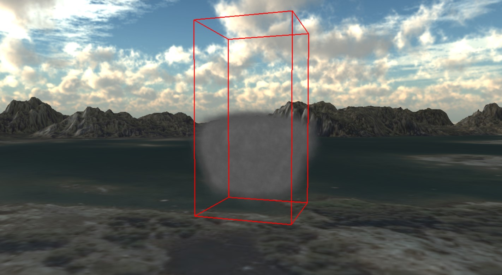

# Computer Graphics Particle Systems

This repository contains two computer graphics projects developed as part of the  **[TDA362 Computer Graphics Labs](https://www.cse.chalmers.se/edu/course/TDA362/tutorials/index.html)** course at **Chalmers University of Technology**. The projects demonstrate advanced particle system implementations for simulating realistic fire jets and smoke effects.

**Projects Overview**

- **Fire_Particle_System**: Real-time fighter jet exhaust simulation with particle-based fire effects
- **GPU_Smoke_Particle_System**: GPU-accelerated smoke simulation 

------

## 🚀 Getting Started

### Prerequisites

- **CMake** (version 3.27.9 or higher)
- Modern C++ compiler with OpenGL support
- Graphics card with compute shader support (for GPU_Smoke_Particle_System)

### Installation & Build

1. **Install CMake**

   ```bash
   # Download CMake 3.27.9 or later from https://cmake.org/download/
   ```

2. **Clone the repository**

   ```bash
   git clone [your-repository-url]
   cd [repository-name]
   ```

3. **Choose and build a project**

   Navigate to either `Fire_Particle_System` or `GPU_Smoke_Particle_System` directory:

   ```bash
   cd Fire_Particle_System  # or GPU_Smoke_Particle_System
   ```

4. **Configure with CMake**

   ```bash
   mkdir build
   cd build
   cmake ..
   ```

5. **Compile and run**

   ```bash
   make  # or build with your preferred build system
   ./[executable-name]
   ```

------

## 🔥 Fire_Particle_System


This project creates a cool fire effect, like the exhaust from a fighter jet. It makes fire that looks real by using math to spread particles around and special ways to make them look good on screen.

You can move a fighter jet around using the arrow keys and spacebar. The fire particles are spread out in a way that looks natural, like a sphere. It uses explosion textures to make the fire look even more real. The fire fades out over time, just like real flames would. Particles appear and disappear smoothly.

**How it Works:** We generate a large number of particles that are distributed using a **spherical sampling formula** to create the jet exhaust. To make it more lifelike, we've added **explosion textures** and a **time-based fading shader** that makes the fire dissipate naturally.

------

## 💨 GPU_Smoke_Particle_System



This project implements a **GPU-accelerated smoke simulation** using compute shaders for high-performance particle physics calculations. The system simulates realistic smoke behavior by incorporating multiple physical forces and environmental factors.

Building on particle generation similar to the fire system, we've added **gravity, air resistance, and buoyancy**, and considered how **air flow fields** influence smoke movement. The key is using **compute shaders** on the GPU to quickly update the flow field texture and calculate particle movement, making the simulation highly efficient.


